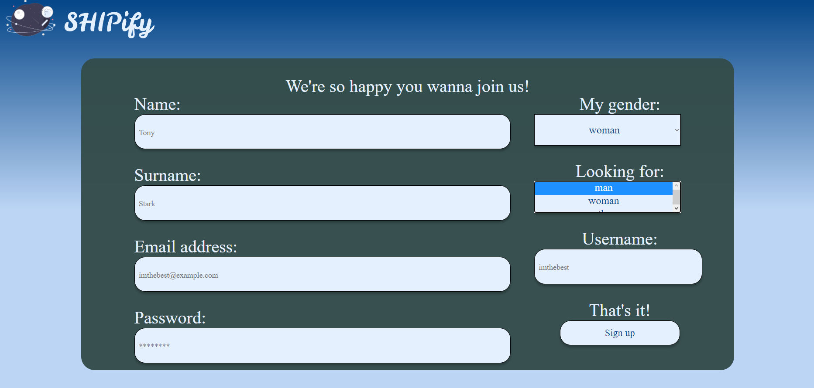
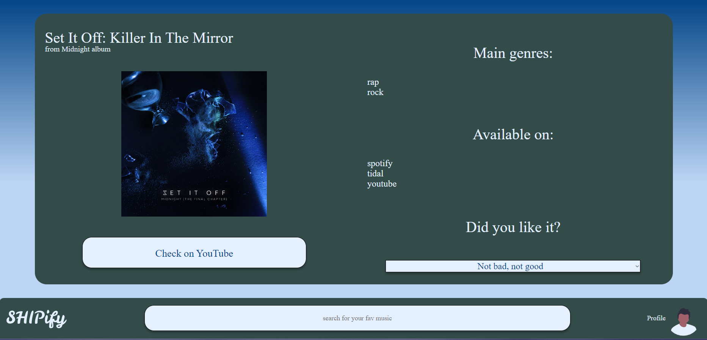
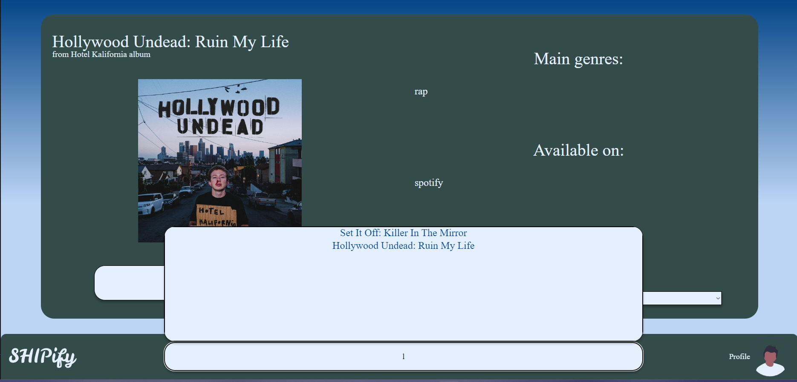
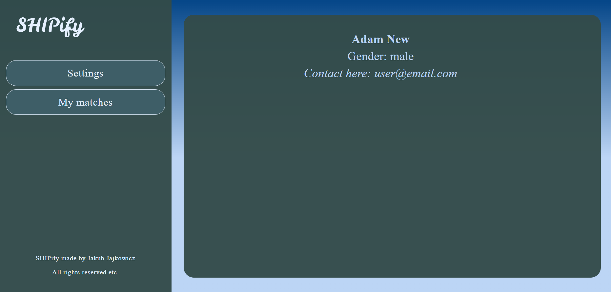
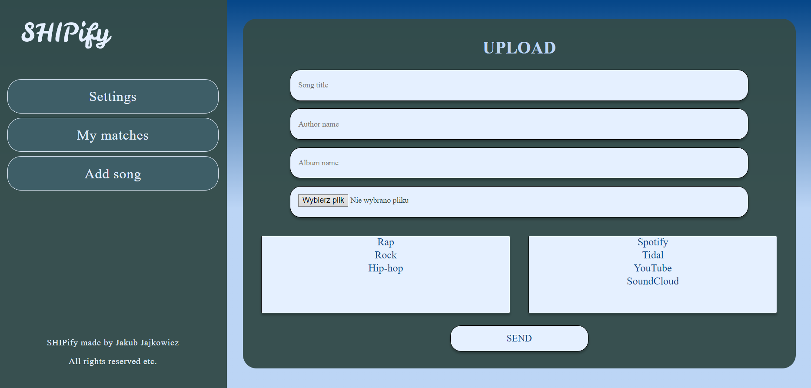

<<<<<<< HEAD
# ZTPAI
=======
# SHIPify

***
Shipify to aplikacja webowa stworzona na potrzeby przedmiotu "Zaawansowane technologie projektowania aplikacji
internetowych".

## Opis

***
Shipify pozwala na łączenie zarejestrowanych użytkowników w pary, bazując na ich gustach muzycznych.

Zwyczajni uzytkownicy mogą ``przeszukiwać`` bazę dodanych piosenek, ``wyświetlać`` ich szczegóły takie jak ``gdzie``
można ich posłuchać lub ``jakie`` gatunki posiada dana piosenka.
Administratorzy poza powyższymi czynnościami mają także opcję ``dodawania`` piosenek do bazy danych.
Dodatkowo, każdy z użytkowników może ``oceniać`` dostępne piosenki i na tej podstawie łączyć się w pary z innymi osobami
o podobnych gustach.

## Wykorzystane technologie

***
Aplikacja korzysta z następujących języków i technologii:

* git
* HTML
* CSS
* SQL (PostgreSQL)
* Java Spring Boot
* Spring Security
* Hibernate
* Lombok
* JWT Token
* Vue.js

## Schemat ERD bazy danych

***


``` 
Schemat został wygenerowany przez intelliJ IDEA 2022.3.2
```

## Galeria zrzutów ekranu

***

## Strona główna


## Strona logowania


## Strona rejestracji



## Strona główna




## Profil user, My matches



## Profil admin, Add song


>>>>>>> dev12
